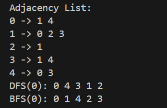

# Graph Traversal using DFS and BFS

## Objective
This project implements the Depth-First Search (DFS) and Breadth-First Search (BFS) algorithms to traverse a graph. The following methods are implemented:

1. DFS(int startVertex): Performs a DFS starting from the given vertex and prints the traversal order. (Recursive approach)
2. BFS(int startVertex): Performs a BFS starting from the given vertex and prints the traversal order.
3. Display(): Prints the graph’s structure using an Adjacency List.

## Overview of the Graph
The graph used in this project is an undirected graph represented using an Adjacency List. In this representation, each vertex points to a list of its neighboring vertices. This structure allows efficient graph traversal using DFS and BFS.

### Graph Details:
Vertices: {0, 1, 2, 3, 4}
Edges: {(0,1), (0,4), (1,2), (1,3), (3,4)}

### Graph Structure (Adjacency List):
Vertex 0: [1, 4]
Vertex 1: [0, 2, 3]
Vertex 2: [1]
Vertex 3: [1, 4]
Vertex 4: [0, 3]

## DFS Traversal Process and Results
### DFS Recursive Approach: 
- Traversal Process: DFS begins at the start vertex (vertex 0). The algorithm explores each branch as deeply as possible before backtracking. It processes vertex 0, then recursively explores all neighbors of vertex 0, and continues down until no unvisited vertices remain in that branch. The algorithm backtracks and continues exploring any unvisited neighbors of previously visited vertices.

- Result: The DFS traversal for this graph starting from vertex 0 is:
0 4 3 1 2

- Explanation: Starting from vertex 0, we visit vertex 4 (a neighbor of 0), then vertex 3 (a neighbor of 4), then vertex 1 (a neighbor of 3), and finally vertex 2 (a neighbor of 1). After visiting all reachable vertices, the traversal ends.

## BFS Traversal Process and Results
### BFS Approach:
- Traversal Process: BFS starts at the given vertex and explores all its neighbors before moving on to the next level of neighbors. It uses a queue to keep track of vertices that need to be processed. After processing a vertex, its unvisited neighbors are enqueued for future processing.

- Result: The BFS traversal for this graph starting from vertex 0 is:
0 1 4 2 3

- Explanation: Starting from vertex 0, we first visit all its neighbors (1 and 4). Then we move to vertex 1's neighbors (2 and 3). The traversal ends once all vertices are processed.

## OutPut

## Observations and Insights
- DFS explores as deeply as possible along each branch before backtracking, which can result in different traversal orders depending on the graph structure.
- BFS, on the other hand, explores all neighbors at the current depth level before moving on to the next level, resulting in a level-order traversal.
- In this specific graph, the results of DFS (recursive) and BFS reflect how these algorithms handle graph traversal differently. DFS visits vertices in a depth-first manner, while BFS visits vertices in a breadth-first manner, processing all neighbors at each level before moving deeper.